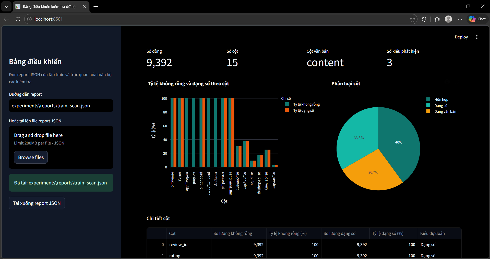
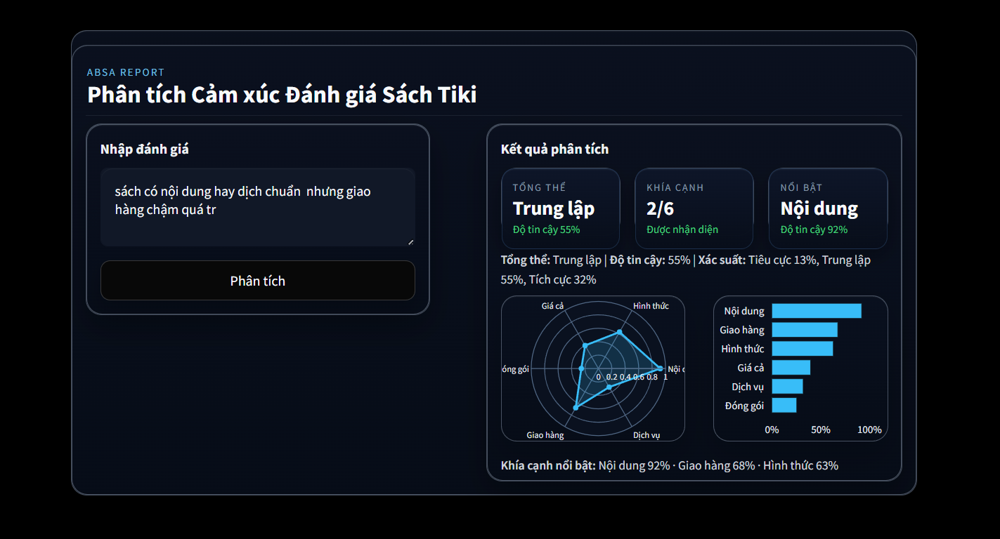

# Vietnamese Book Review ABSA (Aspect-Based Sentiment Analysis)

[](https://www.python.org/)
[](https://streamlit.io/)
[](https://pytorch.org/)
[](https://huggingface.co/)

## 📝 Giới thiệu Project

Dự án **Vietnamese Book Review ABSA** là một hệ thống phân tích cảm xúc đa khía cạnh (Aspect-Based Sentiment Analysis) chuyên biệt cho đánh giá sách trên sàn thương mại điện tử Tiki. Hệ thống kết hợp các mô hình học sâu tiên tiến (PhoBERT, BiLSTM), các thực nghiệm khác nhau và kỹ thuật tiền xử lý văn bản tiếng Việt chuyên sâu để trích xuất thông tin chi tiết từ phản hồi người dùng.

### Các bài toán giải quyết:

1. **Sentiment Classification**: Phân loại cảm xúc tổng thể của review (Tích cực, Trung lập, Tiêu cực).
2. **Aspect Detection**: Nhận diện 6 khía cạnh cốt lõi trong trải nghiệm mua sách:
   * **Nội dung**: Chất lượng nội dung sách, dịch thuật.
   * **Hình thức**: Chất lượng in ấn, giấy, bìa, bookmark.
   * **Giá cả**: Mức giá, khuyến mãi, voucher.
   * **Đóng gói**: Cách bọc sách, chống sốc, hộp carton.
   * **Giao hàng**: Tốc độ giao, thái độ shiper.
   * **Dịch vụ**: Tư vấn, hỗ trợ đổi trả, phản hồi shop.
3. **Aspect-Specific Sentiment**: Xác định cảm xúc cụ thể cho từng khía cạnh vừa được nhận diện.

---

## 🛠️ Thư viện cần cài

Dự án yêu cầu Python 3.8+ và các thư viện chính sau:

```bash
# Cài đặt toàn bộ dependencies
pip install -r requirements.txt
```

**Các thư viện nòng cốt:**
* `transformers` & `torch`: Xử lý mô hình PhoBERT và deep learning.
* `pyvi` & `regex`: Tiền xử lý, tách từ tiếng Việt.
* `streamlit`: Xây dựng giao diện Dashboard.
* `pandas` & `scikit-learn`: Xử lý dữ liệu và baseline mô hình.
* `plotly`: Trực quan hóa báo cáo dữ liệu.

---

### 📊 Hệ thống Dashboard

Dự án cung cấp hai thành phần giao diện chính:

1. **Inference App (`app.py`)**: Giao diện người dùng cuối để nhập review và xem dự đoán ABSA.
2. **Data Dashboard (`dashboard.py`)**: Công cụ dành cho nhà phát triển để kiểm soát chất lượng dữ liệu tập Train/Test.

## Pipeline Tiền Xử Lý

Phần tiền xử lý nằm trong `src/preprocessing/` và được gọi qua `src/preprocessing/pipeline.py`. Các bước chính:
- chuẩn hóa Unicode,
- làm sạch noise text,
- chuẩn hóa emoji,
- chuẩn hóa từ vựng / teencode,
- format lại text,
- lower-case nếu cần,
- lọc các dòng quá ngắn hoặc trùng lặp.

Hàm chính:
- `clean_text_series(...)`
- `preprocess_dataframe(...)`
- `preprocess_file(...)`

## Cấu Trúc Dự Án

```text
├── app.py                      # Dashboard ABSA cho review sách
├── dashboard.py                # Dashboard kiểm tra dữ liệu / report
├── README.md                   # Tài liệu tổng quan dự án
├── requirements.txt            # Danh sách thư viện cần cài
├── .streamlit/
│   └── config.toml             # Theme và cấu hình giao diện Streamlit
├── data/
│   ├── raw/                    # Dữ liệu thô ban đầu
│   ├── interim/                # Dữ liệu trung gian sau khi split
│   ├── processed/              # Dữ liệu đã làm sạch để train/eval
│   └── error_analysis_test.csv  # Mẫu dữ liệu phục vụ phân tích lỗi
├── docs/                       # Tài liệu mô tả dự án
├── experiments/                # Report và kết quả thực nghiệm
│   └── reports/                # JSON report / prediction report
├── notebooks/                  # Notebook thử nghiệm mô hình
├── scripts/
│   ├── check.py                # Kiểm tra phân bố nhãn
│   ├── evaluation.py           # Đánh giá mô hình trên tập test
│   └── vit5_parse.txt          # Ghi chú / parse cho ViT5
├── src/
│   ├── analysis/
│   │   ├── data_scanner.py     # Core scanner tạo report chất lượng dữ liệu
│   │   ├── scan_cli.py         # CLI chạy scan và xuất JSON report
│   │   ├── overview_check.py   # Kiểm tra tổng quan
│   │   ├── missing_values_check.py
│   │   ├── length_check.py
│   │   ├── encoding_check.py
│   │   ├── noise_pattern_check.py
│   │   ├── emoji_check.py
│   │   ├── vocab_check.py
│   │   ├── duplicate_check.py
│   │   ├── label_distribution_check.py
│   │   ├── scan_constants.py
│   │   ├── scan_dataframe.py
│   │   └── helpers.py
│   ├── models/
│   │   ├── architectures.py     # Định nghĩa model ABSA
│   │   └── predictor.py         # Load model và suy luận
│   ├── preprocessing/
│   │   ├── pipeline.py         # Pipeline tiền xử lý chính
│   │   ├── cli.py              # CLI clean train/val/test
│   │   ├── split_dataset.py    # Tách dữ liệu train/val/test
│   │   ├── unicode_norm.py     # Chuẩn hóa Unicode
│   │   ├── emoji_norm.py       # Chuẩn hóa emoji
│   │   ├── vocab_norm.py       # Chuẩn hóa từ vựng / teencode
│   │   ├── noise_cleaner.py    # Làm sạch noise text
│   │   ├── quality_filter.py    # Lọc chất lượng dòng dữ liệu
│   │   ├── formatters.py       # Chuẩn hóa định dạng cuối
│   │   └── map_utils.py        # Hàm hỗ trợ map / transform
│   ├── features/               # Thư mục dự phòng cho feature engineering
│   ├── ui/
│   │   └── styles.py           # CSS cho dashboard
│   └── utils/                  # Hàm tiện ích dùng chung
├── web_crapping/
│   └── crawler.py              # Crawl review sách từ Tiki
├── crawl_data/                 # Dữ liệu crawl ra từ crawler
└── __pycache__/                # File cache Python
```

Tóm lại:
- `app.py` là màn hình demo ABSA.
- `dashboard.py` là màn hình report / data quality.
- `src/` chứa toàn bộ mã nguồn chính.
- `data/` chứa dữ liệu đầu vào, trung gian và đã xử lý.
- `experiments/` chứa report kết quả và prediction output.
- `scripts/` là các lệnh chạy kiểm tra, đánh giá.

## 🚀 Hướng dẫn chạy code

Quy trình triển khai dự án từ thu thập dữ liệu đến chạy ứng dụng:

### 1. Thu thập dữ liệu (Crawling)
Sử dụng script để lấy dữ liệu review sách trực tiếp từ Tiki:
```bash
python web_crapping/crawler.py
```
*Dữ liệu sẽ được lưu tại `crawl_data/tiki_books_reviews_v2.csv`.*

### 2. Chuẩn bị và Tiền xử lý (Preprocessing)
Tách tập dữ liệu và chạy pipeline làm sạch văn bản (Unicode, emoji, noise, teencode):
```bash
# Tách tập Train/Val/Test
python src/preprocessing/split_dataset.py

# Chạy tiền xử lý cho từng tập
python -m src.preprocessing.cli --split train
python -m src.preprocessing.cli --split val
python -m src.preprocessing.cli --split test
```

### 3. Phân tích & Đánh giá (Analysis & Evaluation)
Kiểm tra chất lượng dữ liệu và hiệu năng mô hình:
```bash
# Tạo báo cáo chất lượng dữ liệu (JSON)
python -m src.analysis.scan_cli --input data/interim/raw_train/train.json --output experiments/reports/train_scan.json

# Đánh giá mô hình trên tập Test
python scripts/evaluation.py
```

### 4. Khởi chạy Dashboard (UI)
Dự án cung cấp 2 giao diện Streamlit:
* **ABSA Inference Dashboard**: Demo dự đoán cảm xúc đa khía cạnh.
```bash
streamlit run app.py
```
* **Data Quality Dashboard**: Phân tích và thống kê tập dữ liệu.
```bash
streamlit run dashboard.py
```

---

## 🔄 Luồng xử lý toàn diện (Full Pipeline)
1. **Crawl** review từ Tiki.
2. **Split** dữ liệu tại `data/raw/`.
3. **Clean** dữ liệu qua `src/preprocessing/`.
4. **Scan** chất lượng để tạo report JSON.
5. **Train/Experiment** trong `notebooks/`.
6. **Evaluate** kết quả cuối cùng.
7. **Deploy** demo với Streamlit.

## File Dữ Liệu / Report Quan Trọng
- `data/processed/train_clean.json`
- `data/processed/val_clean.json`
- `data/processed/test_clean.json`
- `experiments/reports/train_scan.json`
- `experiments/reports/train_clean_scan.json`
- `experiments/reports/fasttext_xgboost_v3_nosmote_predictions.json`
- `experiments/reports/fasttext_xgboost_v4_two_stage_neutral_predictions.json`

## Giao diện Dashboard

Hệ thống cung cấp hai giao diện Dashboard chuyên biệt:

### 1. Dashboard Kiểm tra dữ liệu (Data Quality Dashboard)
Cho phép phân tích đặc điểm tập dữ liệu, phát hiện nhiễu và kiểm tra phân bố nhãn trước khi huấn luyện.



### 2. Dashboard Phân tích ABSA (ABSA Inference Dashboard)
Giao diện người dùng cuối để nhập liệu và phân tích cảm xúc đa khía cạnh thời gian thực.



## Ghi Chú
- `app.py` là giao diện demo ABSA.
- `dashboard.py` là giao diện báo cáo dữ liệu.
- `.streamlit/config.toml` chứa cấu hình theme của Streamlit.
- Các model được load trực tiếp từ Hugging Face khi chạy predictor.

## Tác Giả
- Nguyễn Văn Tấn Phát
- Nguyễn Hoàng Lộc