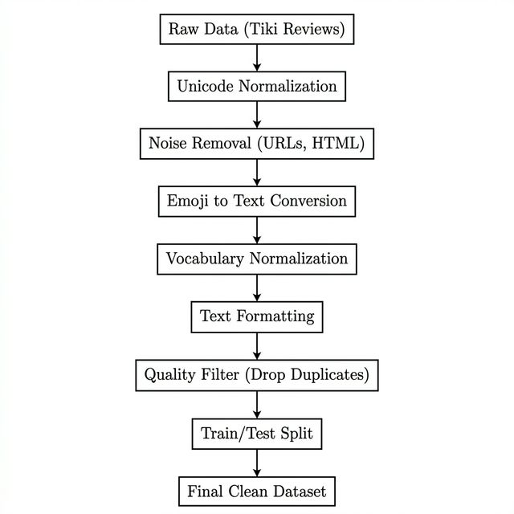

<div align="center">

# 📚 Vietnamese Book Review — Aspect-Based Sentiment Analysis

**Phân tích Cảm xúc Đa khía cạnh trên Đánh giá Sách Tiki**

[](https://www.python.org/)
[](https://pytorch.org/)
[](https://huggingface.co/vinai/phobert-base-v2)
[](https://streamlit.io/)
[](https://www.kaggle.com/datasets/phtnguyn1ytj/tiki-cleaned-book-reviews)

---

Xây dựng hệ thống **NLP end-to-end** từ thu thập dữ liệu, tiền xử lý chuyên sâu cho Tiếng Việt,  
đến huấn luyện mô hình Deep Learning **PhoBERT** phân tích đồng thời **cảm xúc tổng thể**  
và **6 khía cạnh chi tiết** của một đơn hàng sách.

</div>

---

## 🎯 1. Giới thiệu

Dự án ứng dụng **kỹ thuật Xử lý Ngôn ngữ Tự nhiên (NLP)** và **Deep Learning** để khai phá ý kiến khách hàng từ hàng chục ngàn bài đánh giá sách trên sàn thương mại điện tử **Tiki**.

> 💡 **Điểm khác biệt:** Thay vì chỉ phân loại "Tích cực / Tiêu cực" chung chung, mô hình có khả năng bóc tách đồng thời **6 khía cạnh** của sản phẩm.

| Khía cạnh | Ý nghĩa | Ví dụ |
|:---:|---|---|
| 📖 **Content** | Nội dung sách | *"Sách hay, kiến thức bổ ích"* |
| 📦 **Physical** | Chất lượng vật lý (giấy, bìa, in ấn) | *"Giấy mỏng, in mờ"* |
| 💰 **Price** | Giá cả | *"Giá hợp lý so với chất lượng"* |
| 🎁 **Packaging** | Đóng gói | *"Bọc cẩn thận, có túi chống sốc"* |
| 🚚 **Delivery** | Giao hàng | *"Ship nhanh, đúng hẹn"* |
| 🛎️ **Service** | Chăm sóc khách hàng | *"Nhân viên hỗ trợ nhiệt tình"* |

### 🔍 Sơ đồ Pipeline Tiền Xử Lý

<p align="center">
  
</p>

---

## 📁 2. Cấu trúc Thư mục

```text
DoAn2/
│
├── 📂 data/                         # Vòng đời dữ liệu
│   ├── raw/                         #   └─ Dữ liệu thô (.csv) từ Tiki
│   ├── interim/                     #   └─ Đã chia Train/Test, chưa làm sạch
│   └── processed/                   #   └─ Sạch 100%, sẵn sàng huấn luyện
│
├── 📂 src/                          # Source code lõi (Module hóa)
│   ├── analysis/                    #   └─ Data Scanner & báo cáo lỗi
│   └── preprocessing/               #   └─ Pipeline làm sạch văn bản ↓
│       ├── unicode_norm.py          #       Chuẩn hóa dấu thanh Tiếng Việt
│       ├── noise_cleaner.py         #       Xóa URL, HTML, SĐT, Email
│       ├── emoji_norm.py            #       Chuyển Emoji → chuỗi ký tự
│       ├── vocab_norm.py            #       Sửa Teencode, từ viết tắt
│       ├── formatters.py            #       Lowercase, cắt khoảng trắng thừa
│       ├── quality_filter.py        #       Lọc câu ngắn & xóa trùng lặp
│       ├── pipeline.py              #       Đóng gói toàn bộ → 1 ống xử lý
│       ├── split_dataset.py         #       Chia 80/20 Train-Test (Stratified)
│       └── cli.py                   #       Giao diện dòng lệnh (CLI)
│
├── 📂 notebooks/                    # Jupyter Notebooks thực nghiệm
│   ├── 01_before_after_...          #   └─ So sánh trước/sau tiền xử lý
│   ├── 02_eda_detailed_...          #   └─ Khám phá & trực quan dữ liệu
│   ├── 03_phobert_balance_...       #   └─ Xử lý mất cân bằng nhãn
│   └── 04_absa_roberta_...          #   └─ Huấn luyện PhoBERT Multi-task
│
├── 📂 experiments/reports/          # Báo cáo JSON từ Data Scanner
├── 📂 web_crapping/                 # Scripts cào dữ liệu từ Tiki
│
├── dashboard.py                     # 📊 Web App trực quan (Streamlit)
├── requirements.txt                 # 📋 Danh sách thư viện
└── README.md                        # 📄 Bạn đang đọc file này!
```

---

## ⚙️ 3. Cài đặt

> **Yêu cầu:** Python ≥ 3.8

```bash
# Clone repo
git clone https://github.com/nvtanphat/vietnamese-book-review-absa.git
cd vietnamese-book-review-absa

# Cài đặt thư viện
pip install -r requirements.txt
```

<details>
<summary>📦 <b>Thư viện chính sử dụng</b></summary>

| Thư viện | Mục đích |
|---|---|
| `pandas` | Xử lý DataFrame |
| `scikit-learn` | Chia tập Train/Test |
| `emoji` | Phân tích biểu tượng cảm xúc |
| `ftfy` | Sửa lỗi encoding Unicode |
| `regex` | Biểu thức chính quy nâng cao |
| `plotly` | Vẽ biểu đồ tương tác |
| `streamlit` | Xây dựng Dashboard Web |
| `torch` | Framework Deep Learning |
| `transformers` | Hugging Face (PhoBERT) |

</details>

---

## 🚀 4. Hướng dẫn Chạy

> ⚠️ Luôn đứng tại **thư mục gốc** của dự án để thực thi.

| Bước | Mô tả | Lệnh |
|:---:|---|---|
| **1** | Làm sạch dữ liệu & Chia Train/Test | `python -m src.preprocessing.split_dataset` |
| **2** | Quét lỗi & Xuất báo cáo thống kê | `python -m src.analysis.scan_cli` |
| **3** | Mở Dashboard trực quan hóa | `streamlit run dashboard.py` |
| **4** | Huấn luyện mô hình PhoBERT | Chạy lần lượt `notebooks/01_` → `04_` |

---

## 👨‍💻 5. Đội ngũ thực hiện

<table>
  <tr>
    <td align="center"><b>Nguyễn Văn Tấn Phát</b></td>
    <td align="center"><b>Nguyễn Hoàng Lộc</b></td>
  </tr>
</table>

---

<div align="center">

**⭐ Nếu dự án hữu ích, hãy cho chúng mình một Star nhé!**

*MIT License © 2026*

</div>
