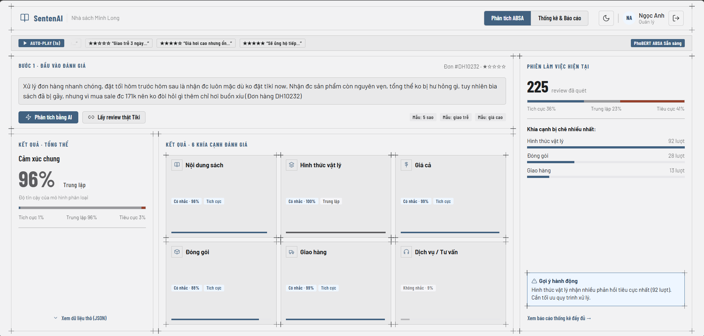

# ⚡ SentenAI: Hệ Thống ABSA Tiếng Việt Cho Thương Mại Điện Tử

<div align="center">

[](https://www.python.org/)
[](https://fastapi.tiangolo.com/)
[](https://nextjs.org/)
[](https://pytorch.org/)
[](LICENSE)

**Hệ sinh thái Phân tích Cảm xúc theo Khía cạnh (Aspect-Based Sentiment Analysis) tiếng Việt**  
*Tập dữ liệu tự thu thập & gán nhãn độc quyền • Fair Benchmark 8 Mô hình • Remote Kaggle GPU • Production API & Dashboard*

<br />



</div>

---

## 📌 Giới Thiệu & Tính Năng Nổi Bật

**SentenAI** là hệ thống ABSA mức công nghiệp được xây dựng trên **bộ dữ liệu tự thu thập và gán nhãn chuẩn hóa** gồm **13,412 bình luận thực tế từ Tiki** (2,009 sản phẩm sách).

- 📦 **Dữ Liệu Tự Thu Thập & Gán Nhãn Độc Quyền**: Sử dụng bộ thu thập dữ liệu riêng ([`scraper/`](scraper)) để cào trực tiếp bình luận thực tế từ Tiki, thực hiện làm sạch và **gán nhãn thủ công chuẩn hóa** phản ánh trọn vẹn đặc trưng ngôn ngữ thương mại điện tử Việt Nam (teencode, slang, emoji, từ viết tắt).
- 🎯 **Bài toán Đa Tác Vụ 7 Mục Tiêu**: Dự đoán đồng thời **1 cảm xúc tổng quan** (3 lớp) + **6 cảm xúc khía cạnh** (`content`, `physical`, `price`, `packaging`, `delivery`, `service` — 4 lớp: *Tiêu cực, Trung tính, Tích cực, Vắng mặt*).
- 🧹 **Tiền Xử Lý Chuẩn Hóa Duy Nhất**: Module [`packages/absa_core`](packages/absa_core) xử lý triệt để lỗi mã hóa (mojibake), chuẩn hóa Unicode NFC, teencode, emoji ngữ cảnh và phân đoạn từ PyVi.
- ⚖️ **Quy Chuẩn Fair Benchmark**: Phân tách dữ liệu đóng băng **70/15/15** theo nhóm (Group-Stratified Split) với chữ ký SHA-256 (`c32f956a...`), cố định seed=42 và niêm phong tập Test.
- ⚡ **8 Kiến Trúc Đa Dạng**: Từ Baselines (Logistic, SVM), Deep Learning (TextCNN, BiLSTM), Transformers (PhoBERT, mDeBERTa, XLM-R) tới Generative LLM (ViT5 + LoRA).
- 🚀 **Production & MLOps**: FastAPI REST Engine, Next.js Dashboard thời gian thực, CLI Kaggle GPU Tesla T4 tự động, **ONNX Runtime Engine (INT8 Quantization tối ưu độ trễ CPU)** và quản lý phiên bản dữ liệu DVC / MLflow.

---

## 🏛️ Kiến Trúc Hệ Thống

```text
                                  ┌──────────────────────────────────────────────────────────┐
                                  │            DỮ LIỆU ĐÁNH GIÁ TIKI TỰ THU THẬP             │
                                  │      (13,412 Bình luận | 2,009 Sản phẩm | 7 Mục tiêu)    │
                                  └────────────────────────────┬─────────────────────────────┘
                                                               │
                                                               ▼
                                  ┌──────────────────────────────────────────────────────────┐
                                  │      Pipeline Tiền Xử Lý (packages/absa_core)            │
                                  │   Unicode NFC • Làm sạch nhiễu • Teencode • Emoji        │
                                  └────────────────────────────┬─────────────────────────────┘
                                                               │
                                                               ▼
                                  ┌──────────────────────────────────────────────────────────┐
                                  │       Phân Tách Nhóm Cố Định 70/15/15 (Stratified)       │
                                  │   Train (9,300) | Val (1,991) | Sealed Test (1,992)      │
                                  │   Mã băm SHA-256: c32f956aee64af890c0645d37da203a9...    │
                                  └─────────┬──────────────────┬───────────────────┬─────────┘
                                            │                  │                   │
                      ┌─────────────────────┘                  │                   └─────────────────────┐
                      ▼                                        ▼                                         ▼
         ┌─────────────────────────┐              ┌─────────────────────────┐              ┌─────────────────────────┐
         │    Baseline Cổ Điển     │              │    Mạng Nơ-ron Chuỗi    │              │  Transformer Tiền Huấn  │
         │  • Logistic Regression  │              │  • TextCNN              │              │  • PhoBERT-base         │
         │  • Linear SVM (TF-IDF)  │              │  • BiLSTM               │              │  • XLM-RoBERTa-base     │
         └────────────┬────────────┘              └────────────┬────────────┘              │  • mDeBERTa-v3-base     │
                      │                                        │                           │  • ViT5 + LoRA (Sinh)   │
                      │                                        │                           └────────────┬────────────┘
                      └────────────────────────────┬───────────┴────────────────────────────────────────┘
                                                   │
                                                   ▼
                                  ┌──────────────────────────────────────────────────────────┐
                                  │         Hiệu Chỉnh Ngưỡng Hiện Diện (Validation Only)    │
                                  │       Tối ưu P(present) = 1 - P(absent) >= t_aspect      │
                                  │     Hàm mục tiêu: 3-Class Macro F1 + Neutral Protection  │
                                  └────────────────────────────┬─────────────────────────────┘
                                                               │
                                                               ▼
                                  ┌──────────────────────────────────────────────────────────┐
                                  │             Xếp Hạng Bảng Benchmark Công Bằng            │
                                  │            Đánh giá theo Validation F1 Kết hợp:          │
                                  │   F1_comb = 0.5 * F1_overall + 0.5 * mean(F1_aspects)    │
                                  └────────────────────────────┬─────────────────────────────┘
                                                               │
                                                               ▼
                                  ┌──────────────────────────────────────────────────────────┐
                                  │               Cổng Chất Lượng & Đề Xuất                  │
                                  │    Mở niêm phong Test -> Đăng ký -> artifacts/final/     │
                                  └─────────┬──────────────────────────────────────┬─────────┘
                                            │                                      │
                                            ▼                                      ▼
                         ┌─────────────────────────────────────┐ ┌─────────────────────────────────────┐
                         │          FastAPI REST Engine        │ │        Next.js Web Dashboard        │
                         │   • /predict (Đơn & Hàng loạt)      │ │   • Thử nghiệm phân tích real-time  │
                         │   • /model-info & Giám sát Drift    │ │   • Thống kê biểu đồ khía cạnh      │
                         └─────────────────────────────────────┘ └─────────────────────────────────────┘
```

---

## 📊 Dữ Liệu Tự Xây Dựng & Quy Chuẩn Gán Nhãn

Bộ dữ liệu gốc nằm tại [`data/raw/tiki-book-review_merged_fixed_v3.json`](data/raw/tiki-book-review_merged_fixed_v3.json) được **tự thu thập và gán nhãn thủ công chuẩn hóa** cho 7 mục tiêu song song. Chi tiết xem tại 📑 [**Hướng Dẫn Dán Nhãn Khía Cạnh ABSA**](docs/absa_annotation_guide.md).

| Mục Tiêu | Mã Khía Cạnh | Lớp 0 | Lớp 1 | Lớp 2 | Lớp 3 |
| :--- | :--- | :---: | :---: | :---: | :---: |
| **Cảm xúc tổng quan** | `overall_sentiment` | Tiêu cực | Trung tính | Tích cực | — |
| **Nội dung sách** | `as_content` | Tiêu cực | Trung tính | Tích cực | Vắng mặt |
| **Hình thức sách** | `as_physical` | Tiêu cực | Trung tính | Tích cực | Vắng mặt |
| **Giá cả & Ưu đãi** | `as_price` | Tiêu cực | Trung tính | Tích cực | Vắng mặt |
| **Quy cách đóng gói**| `as_packaging` | Tiêu cực | Trung tính | Tích cực | Vắng mặt |
| **Dịch vụ vận chuyển**| `as_delivery` | Tiêu cực | Trung tính | Tích cực | Vắng mặt |
| **Chăm sóc khách hàng**| `as_service` | Tiêu cực | Trung tính | Tích cực | Vắng mặt |

---

## 🏆 Bảng Kết Quả Benchmark Chi Tiết (Full Leaderboard)

> Kết quả được tổng hợp trực tiếp và đồng nhất từ pipeline huấn luyện & đánh giá niêm phong trên tập Test (`seed=42`, mã băm tập dữ liệu `c32f956aee64...`).

### 1. Bảng Tổng Quan (Overall & Metrics Summary)

| Mô Hình | Họ Kiến Trúc | Val $\text{F1}_{\text{comb}}$ | Test $\text{F1}_{\text{comb}}$ | Test $\text{F1}_{\text{overall}}$ | Test $\text{F1}_{\text{presence}}$ | Test $\text{F1}_{\text{present}}$ | Test 4-Class Mean | Exact Match | Label Acc | Số Params | Trạng Thái |
| :--- | :--- | :---: | :---: | :---: | :---: | :---: | :---: | :---: | :---: | :---: | :---: |
| **PhoBERT + XLM-R** | Probability Ensemble | **0.7863** | **0.7911** | **0.8263** | **0.9475** | **0.7776** | **0.7560** | **0.5924** | **0.9169** | 413M | 👑 **State-of-the-Art** |
| **XLM-RoBERTa-base** | Hierarchical Transformer | 0.7722 | 0.7823 | 0.8194 | 0.9455 | 0.7650 | 0.7453 | 0.5818 | 0.9122 | 278M | 🥈 Candidate |
| **PhoBERT-base** | Hierarchical Transformer | 0.7742 | 0.7740 | 0.8202 | 0.9418 | 0.7507 | 0.7278 | 0.5648 | 0.9099 | 135M | 🏆 **Champion** |
| **ViT5 + LoRA** | Sinh chuỗi Seq2Seq | 0.7375 | 0.7294 | 0.7567 | 0.9205 | 0.7437 | 0.7021 | 0.5161 | 0.8944 | 220M | ✅ Hoàn thành |
| **mDeBERTa-v3-base** | Hierarchical Transformer | 0.7250 | 0.7284 | 0.7893 | 0.9110 | 0.7011 | 0.6675 | 0.4593 | 0.8759 | 86M | ✅ Hoàn thành |
| **Linear SVM** | Baseline cổ điển (TF-IDF) | 0.7283 | 0.7090 | 0.7592 | 0.9075 | 0.7004 | 0.6588 | 0.4483 | 0.8781 | — | ✅ Hoàn thành |
| **BiLSTM** | Mạng nơ-ron tuần tự | 0.6588 | 0.6466 | 0.7713 | 0.6782 | 0.6728 | 0.5219 | 0.0753 | 0.6603 | 2.7M | ✅ Hoàn thành |
| **TextCNN** | Mạng nơ-ron tích chập | 0.5915 | 0.5996 | 0.7679 | 0.5776 | 0.6059 | 0.4313 | 0.0020 | 0.5534 | 1.3M | ✅ Hoàn thành |
| **Logistic Reg.** | Baseline cổ điển (TF-IDF) | 0.5072 | 0.4949 | 0.4180 | 0.8765 | 0.5776 | 0.5718 | 0.2018 | 0.8021 | — | ✅ Hoàn thành |

<br />

### 2. Bảng Chi Tiết $\text{F1}$ Theo 6 Khía Cạnh Cụ Thể (Per-Aspect F1 Breakdown)

| Mô Hình | Nội dung (`content`) | Hình thức (`physical`) | Giá cả (`price`) | Đóng gói (`packaging`) | Giao hàng (`delivery`) | Dịch vụ (`service`) | $\text{F1}_{\text{aspect\_mean}}$ |
| :--- | :---: | :---: | :---: | :---: | :---: | :---: | :---: |
| **PhoBERT + XLM-R** | **0.7753** | **0.8017** | 0.6618 | 0.7435 | 0.7274 | **0.6159** | **0.7560** |
| **XLM-RoBERTa-base** | 0.7460 | 0.7900 | 0.6537 | **0.7554** | 0.7246 | 0.6042 | 0.7453 |
| **PhoBERT-base** | 0.7692 | 0.7854 | **0.6879** | 0.7153 | 0.6451 | 0.5051 | 0.7278 |
| **ViT5 + LoRA** | 0.7037 | 0.7663 | 0.5740 | 0.7418 | **0.7347** | 0.5290 | 0.7021 |
| **mDeBERTa-v3-base** | 0.6916 | 0.7829 | 0.5205 | 0.7200 | 0.5411 | 0.4726 | 0.6675 |
| **Linear SVM** | 0.6669 | 0.7306 | 0.5334 | 0.6192 | 0.6854 | 0.5280 | 0.6588 |
| **BiLSTM** | 0.6752 | 0.7543 | 0.5906 | 0.6955 | 0.6433 | 0.4163 | 0.5219 |
| **TextCNN** | 0.6391 | 0.7269 | 0.5760 | 0.5939 | 0.5534 | 0.3572 | 0.4313 |
| **Logistic Reg.** | 0.5452 | 0.5301 | 0.5375 | 0.5602 | 0.5772 | 0.3378 | 0.5718 |

---

## 🚀 Hướng Dẫn Cài Đặt & Sử Dụng Nhanh

### 1. Cài Đặt Môi Trường
```bash
git clone https://github.com/nvtanphat/tiki-book-review-absa.git
cd tiki-book-review-absa

# Cài đặt với uv (Khuyến nghị)
uv sync --group ml --group mlops

# Hoặc pip truyền thống
pip install -r requirements.txt
pip install -e packages/absa_core
```

### 2. Huấn Luyện & Benchmark
```bash
# Huấn luyện mô hình bất kỳ (phobert, xlmr, mdeberta, vit5, bilstm, textcnn, linear_svm, logistic)
python -m ml.train --model phobert

# Tối ưu siêu tham số Optuna (20 trials)
python -m ml.tune --model phobert --trials 20

# Đề xuất mô hình Champion tốt nhất sang artifacts/final/
python -m ml.benchmark --promote-best
```

### 3. Huấn Luyện Từ Xa Kaggle GPU (Tesla T4)
```bash
python -m tools.kaggle_cli doctor
python -m tools.kaggle_cli run --owner USERNAME --dataset USERNAME/sentenai-data --model phobert --accelerator NvidiaTeslaT4
python -m tools.kaggle_cli collect --owner USERNAME --model phobert --register
```

### 4. Tối Ưu Tốc Độ Với ONNX Runtime (CPU / Edge)
```bash
# Export mô hình Champion sang ONNX Runtime (FP32, FP16, INT8 Quantization)
python packages/absa_core/scripts/export_onnx_unified.py
```

---

## 🌐 Triển Khai Production & Web Dashboard

```bash
# Terminal 1: Khởi chạy Backend REST API (FastAPI tại http://localhost:8000/docs)
make api

# Terminal 2: Khởi chạy Frontend Dashboard (Next.js tại http://localhost:3000)
make install-web && make web
```

**Ví dụ cURL API:**
```bash
curl -X POST "http://localhost:8000/api/v1/absa/predict" \
     -H "Content-Type: application/json" \
     -d '{"text": "Sách in đẹp, giao nhanh nhưng đóng gói móp nhẹ."}'
```

---

## 📂 Cấu Trúc Thư Mục Dự Án

```text
SentenAI-Unified/
├── data/                  # Tập dữ liệu gốc Tiki & splits Train/Val/Test
├── ml/                    # 8 Kiến trúc mô hình, pipeline train & evaluation
├── packages/absa_core/    # Core library tiền xử lý tiếng Việt & Predictor
├── apps/                  # API FastAPI (apps/api) & Dashboard Next.js (apps/web)
├── mlops/                 # DVC, MLflow tracking, quality gate & drift detector
├── tools/kaggle_cli/      # Bộ CLI điều phối huấn luyện Kaggle GPU
├── artifacts/             # File weights mô hình Champion & registry
└── tests/                 # Unit & Integration test suites
```

---

## 📜 Giấy Phép & Trích Dẫn

Dự án được phân phối theo giấy phép **MIT License** - xem chi tiết tại [LICENSE](LICENSE).

```bibtex
@software{sentenai_2026,
  author = {Nguyen, Van Tan Phat and Contributors},
  title = {SentenAI: Industrial Vietnamese Aspect-Based Sentiment Analysis and Fair Benchmark Orchestration},
  year = {2026},
  publisher = {GitHub},
  journal = {GitHub repository},
  url = {https://github.com/nvtanphat/tiki-book-review-absa}
}
```
