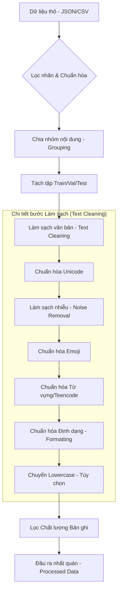

# Quy trình Tiền xử lý Dữ liệu (Preprocessing Pipeline)

Tài liệu này mô tả chi tiết luồng hoạt động của pipeline tiền xử lý dữ liệu cho bài toán Phân tích Cảm xúc và Khía cạnh (ABSA) đối với bình luận sách tiếng Việt.

## 1. Sơ đồ Luồng Hoạt động

---

## 2. Chi tiết các Giai đoạn

### Bước 1: Tiếp nhận và Sàng lọc Dữ liệu Thô
*   **Đọc dữ liệu**: Hỗ trợ định dạng JSON và CSV từ nguồn thô (Raw).
*   **Lọc nhãn**: Chỉ giữ lại các bản ghi có nhãn cảm xúc hợp lệ, loại bỏ các dòng bị nhiễu hoặc thiếu nhãn quan trọng.
*   **Chuẩn hóa nhãn**: Chuyển đổi các giá trị nhãn về dạng số nguyên chuẩn (0/1/2) tương ứng với các lớp cảm xúc mục tiêu.

### Bước 2: Phân tách Tập dữ liệu (Split Strategy)
Để tránh hiện tượng rò rỉ dữ liệu (data leakage), quy trình thực hiện phân tách theo nhóm nội dung:
*   **Tạo khóa nhóm**: Mỗi câu review được làm sạch sơ bộ để tạo ra một "khóa đại diện" cho nội dung.
*   **Gom nhóm**: Các review có nội dung trùng lặp hoặc gần trùng sẽ được đưa vào cùng một nhóm nội dung.
*   **Chia tỷ lệ**: Thực hiện chia nhóm theo tỷ lệ **70/15/15** (Train/Val/Test).
*   **Phân lớp (Stratify)**: Thực hiện phân lớp theo nhãn chi phối của từng nhóm để đạt được sự cân bằng giữa các tập con.

### Bước 3: Pipeline Làm sạch Văn bản (Text Cleaning)
Thứ tự xử lý được thiết kế tối ưu để đảm bảo không làm mất thông tin hữu ích:

1.  **Chuẩn hóa Unicode**: 
    *   Sửa lỗi mã hóa (mojibake).
    *   Đưa văn bản về dạng Unicode dựng sẵn (NFC).
    *   Loại bỏ các ký tự điều khiển và ký tự ẩn.
2.  **Làm sạch nhiễu**:
    *   Loại bỏ các thẻ HTML còn sót lại.
    *   Thay thế URLs, Emails, và Số điện thoại bằng các token chuẩn (ví dụ: `[URL]`, `[PHONE]`).
3.  **Chuẩn hóa Emoji**:
    *   Chuyển emoji sang dạng alias text.
    *   Ánh xạ alias sang từ khóa tiếng Việt tương ứng (ví dụ: `❤️` → `yêu thích`).
    *   Sử dụng token fallback `emoji_*` nếu không tìm thấy trong bảng ánh xạ.
4.  **Chuẩn hóa Từ vựng & Teencode**:
    *   Sử dụng từ điển ánh xạ để chuẩn hóa slang, teencode về từ chuẩn.
    *   Xử lý co kéo ký tự kéo dài (ví dụ: "vuiiiii" → "vui").
    *   Kiểm soát chặt chẽ các thay thế 1 ký tự để tránh làm sai lệch ngữ nghĩa.
5.  **Chuẩn hóa Định dạng (Formatting)**:
    *   Giảm lặp dấu câu (ví dụ: `!!!` → `!!`).
    *   Xóa ký tự zero-width, BOM.
    *   Gom khoảng trắng thừa và cắt khoảng trắng đầu/cuối (trim).
6.  **Chuyển chữ thường (Lowercase)**: Thực hiện nếu cấu hình yêu cầu (thường dùng cho các mô hình không phân biệt hoa thường).

### Bước 4: Lọc Chất lượng (Quality Filtering)
Sau khi làm sạch, các bản ghi được kiểm tra lại để đảm bảo chất lượng cho mô hình học:
*   **Loại bỏ rác**: Loại bỏ các dòng rỗng hoặc chứa marker vô nghĩa (`null`, `nan`, `#name?`, ...).
*   **Lọc nội dung nghèo nàn**: Loại bỏ các dòng chỉ chứa toàn số hoặc ký hiệu.
*   **Ngưỡng độ dài**: Chỉ giữ các review có độ dài tối thiểu (mặc định 10 ký tự) để đảm bảo có đủ thông tin ngữ cảnh.
*   **Khử trùng lặp**: Có thể bật/tắt tùy theo mục đích huấn luyện hoặc đánh giá.

### Bước 5: Chuẩn hóa Đầu ra
*   **Cấu trúc cột**: Giữ đúng bộ cột phục vụ bài toán Sentiment và Aspect.
*   **Kiểu dữ liệu**: Đảm bảo toàn bộ nhãn và văn bản có kiểu dữ liệu nhất quán.
*   **Sản phẩm cuối**:
    *   **Bản Raw Split**: Dữ liệu gốc đã được chia tập nhưng chưa qua xử lý text (dùng cho tham chiếu).
    *   **Bản Processed**: Dữ liệu đã hoàn thiện, sẵn sàng đưa vào mô hình huấn luyện hoặc dashboard phân tích.

---

> [!TIP]
> Việc tách Split theo nhóm nội dung là bước quan trọng nhất để đảm bảo kết quả đánh giá mô hình phản ánh đúng khả năng tổng quát hóa thực tế, thay vì chỉ ghi nhớ các mẫu lặp lại.

> [!IMPORTANT]
> Thứ tự các bước làm sạch text đã được thực nghiệm để đảm bảo các token như emoji hoặc teencode không bị phá vỡ cấu trúc bởi các bộ lọc nhiễu phía sau.
